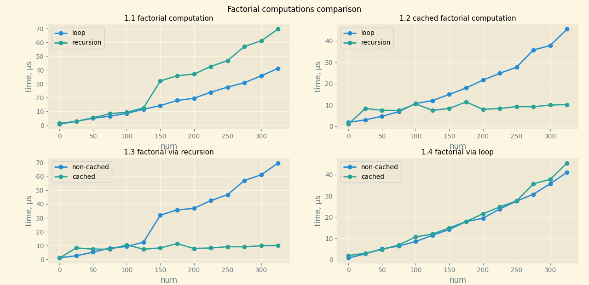

## Сравнение работы вычисления факториала рекурсивным и итеративным способами 

В ходе работы были получены следующие данные о времени работы функций `factorial`, `factorial_rec`, `factorial_cached`, `factorial_rec_cached`. Диапазон тестирования - `list(range(0, 350, 25))`.

Из графика `1.1` (`factorial computation`) видно, что итеративный факториал вычисляется быстрее рекурсивного из-за отсутсвия расходов на вызовы/возвраты функции/из функции соответственно.

График `1.3` (`factorial via recursion`) показывает значительный прирост к скорости работы рекурсивного факториала при использовании кэширования, что объясняется считыванием из области памяти уже посчитанного значения факториала на последующих аргументах. Наоборот, согласно графику `1.4` (`fdctorial via loop`), прирост к скорости работы итеративного факториала от использования кэширования отсутствует, так как для каждого `n` приходится пересчитывать все значения факториала; кэширования не происходит, так как функция вызывается единожды для каждого `n`.

## Выводы

Итеративный факториал работает быстрее рекурсивного, но в случае использования кэширования (график `1.2`, `cached factorial computation`) рекурсивный факториал эффективнее итеративного. При этом кэширование показало лучший результат в приросте к скорости работы для рекурсии, так как уменьшение времени работы происходит из-за повторного вызова функции на уже посчитанных аргументах.
