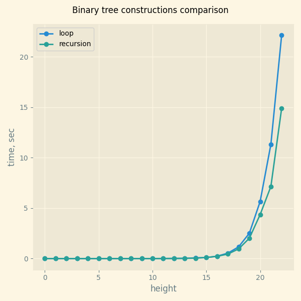

## Рекурсивная и итеративная функции построения бинарного дерева

Мы получили время работы `gen_bin_tree` сделанное рекурсивной и итеративной функциями.

## Вывод

Рекурсивный метод выигрывает итеративный, т.к для итерации бинарное дерево имеет много элементов, что не проблема для рекурсивной функции