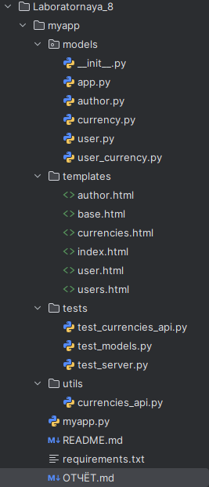
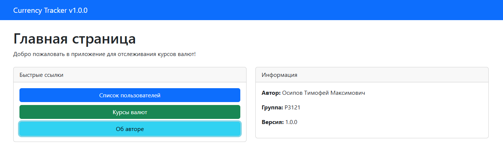
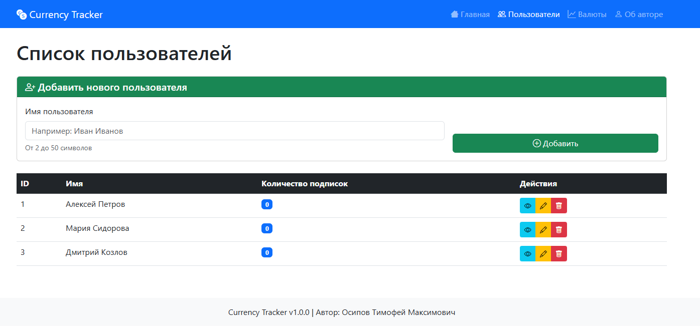
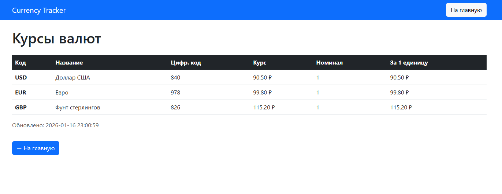
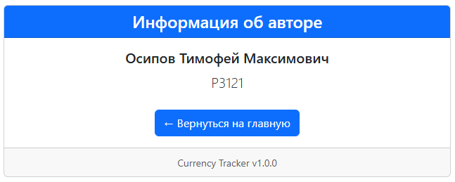
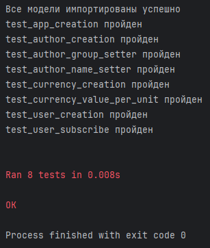
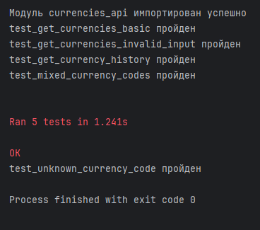
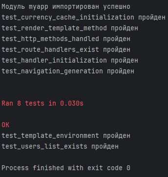

# Лабораторная работа 8. Клиент-серверное приложение на Python с использованием Jinja2

**Автор:** Осипов Тимофей Максимович  
**Группа:** ИСУ: 504902  
**Дата:** [текущая дата]

---

## 1. Цель работы

Целью работы было создание клиент-серверного веб-приложения для отслеживания курсов валют с использованием архитектуры MVC. Основные задачи:

- Реализация моделей предметной области (User, Currency, UserCurrency, App, Author) с геттерами и сеттерами
- Создание сервера на основе HTTPServer с маршрутизацией запросов
- Применение шаблонизатора Jinja2 для динамического отображения данных
- Интеграция функции получения курсов валют через внешнее API
- Реализация функциональности подписок пользователей на валюты
- Написание тестов для проверки корректности работы приложения

---

## 2. Описание предметной области

### Модели

**Author** - информация об авторе приложения:
- `name` (str) - имя автора
- `group` (str) - учебная группа

**App** - описание приложения:
- `name` (str) - название приложения
- `version` (str) - версия приложения  
- `author` (Author) - объект автора

**User** - пользователь системы:
- `id` (int) - уникальный идентификатор
- `name` (str) - имя пользователя
- `subscribed_currencies` (List[Currency]) - список подписок на валюты

**Currency** - информация о валюте:
- `id` (int) - уникальный идентификатор
- `num_code` (str) - цифровой код (3 символа)
- `char_code` (str) - символьный код (3 символа)
- `name` (str) - название валюты
- `value` (float) - текущий курс
- `nominal` (int) - номинал

**UserCurrency** - связь пользователя и валюты (многие-ко-многим):
- `id` (int) - уникальный идентификатор связи
- `user_id` (int) - ID пользователя
- `currency_id` (int) - ID валюты

---

## 3. Структура проекта


**Назначение ключевых файлов:**
- `myapp.py` - точка входа, содержит HTTP сервер и контроллер
- `models/` - реализация бизнес-логики и данных
- `templates/` - представления (View) в архитектуре MVC
- `utils/currencies_api.py` - работа с внешним API курсов валют

---

## 4. Описание реализации

### 4.1. Реализация моделей и свойств

Каждая модель реализована как класс с использованием `dataclasses` и аннотациями типов. Для свойств реализованы геттеры и сеттеры с проверкой корректности данных.

**Пример класса User (user.py):**
```python
@dataclass
class User:
    """Класс, представляющий пользователя системы."""
    
    id: int
    name: str
    subscribed_currencies: List['Currency'] = field(default_factory=list)
    
    def __post_init__(self):
        """Проверка корректности данных после инициализации."""
        if not isinstance(self.id, int) or self.id <= 0:
            raise ValueError("ID должен быть положительным целым числом")
        if not isinstance(self.name, str) or len(self.name.strip()) < 2:
            raise ValueError("Имя должно быть строкой длиной не менее 2 символов")
    
    def subscribe_to_currency(self, currency: 'Currency') -> None:
        """Добавить валюту в список подписок пользователя."""
        if currency not in self.subscribed_currencies:
            self.subscribed_currencies.append(currency)
```


### 4.2. Реализация маршрутов и обработки запросов
Сервер реализован на основе HTTPServer и BaseHTTPRequestHandler. Маршрутизация осуществляется через анализ self.path и urllib.parse.

Основные маршруты в myapp.py:

```python
def do_GET(self):
    parsed_path = urlparse(self.path)
    path = parsed_path.path
    
    if path == '/':
        self._handle_home()
    elif path == '/users':
        self._handle_users()
    elif path == '/user':
        self._handle_user_detail(query_params)
    elif path == '/currencies':
        self._handle_currencies()
    elif path == '/author':
        self._handle_author()
    else:
        self._handle_404()
```
Обработка POST-запросов для CRUD операций:

```python
def do_POST(self):
    if path == '/users':
        self._handle_add_user()
    elif path == '/edit-user':
        self._handle_edit_user()
    elif path == '/delete-user':
        self._handle_delete_user()
```
### 4.3. Использование шаблонизатора Jinja2
Инициализация Environment выполняется один раз при старте приложения:

```python
env = Environment(
    loader=PackageLoader("myapp"),  # или FileSystemLoader для отладки
    autoescape=select_autoescape()
)
```
 Принципы использования:

Шаблоны хранятся в папке templates/
Рендеринг выполняется с передачей контекста
Используется наследование шаблонов через 

Пример рендеринга:

```python
def _render_template(self, template_name: str, **context) -> str:
    template = self.env.get_template(template_name)
    base_context = {
        'myapp': self.app_instance,
        'author': self.app_instance.author,
    }
    base_context.update(context)
    return template.render(**base_context)
```
### 4.4. Интеграция функции get_currencies
Функция get_currencies реализована в utils/currencies_api.py и использует JSON API Центробанка России:


```python
def get_currencies(currency_codes: List[str]) -> Dict[str, Dict]:
    url = "https://www.cbr-xml-daily.ru/daily_json.js"
    response = requests.get(url, timeout=10)
    data = response.json()
    
    result = {}
    for code in currency_codes:
        if code in data['Valute']:
            valute = data['Valute'][code]
            result[code] = {
                'num_code': str(valute.get('NumCode', '000')),
                'char_code': code,
                'name': valute.get('Name', code),
                'value': valute.get('Value', 0),
                'nominal': valute.get('Nominal', 1)
            }
    
    return result
```
Интеграция с приложением:

```python
def _update_currencies(self):
    """Обновить кэш курсов валют."""
    try:
        currencies_data = get_currencies(['USD', 'EUR', 'GBP', 'CNY', 'JPY'])
        # Преобразование в объекты Currency
        # ...
    except Exception:
        # Запасной вариант с тестовыми данными
        self.currencies_cache = [...]
```
---
## 5. Примеры работы приложения
### 5.1 Скриншоты интерфейса 
   
### 5.2 Примеры вывода данных
Пример JSON ответа от API курсов:

```json
{
  "USD": {
    "num_code": "840",
    "char_code": "USD", 
    "name": "Доллар США",
    "value": 90.50,
    "nominal": 1
  },
  "EUR": {
    "num_code": "978",
    "char_code": "EUR",
    "name": "Евро",
    "value": 99.80,
    "nominal": 1
  }
}
```
Пример HTML таблицы пользователей:

```html
<table class="table table-hover">
  <tr>
    <td>1</td>
    <td>Алексей Петров</td>
    <td><span class="badge bg-primary">2</span></td>
    <td>
      <a href="/user?id=1" class="btn btn-sm btn-info">Просмотр</a>
      <button class="btn btn-sm btn-warning">Редактировать</button>
    </td>
  </tr>
</table>
```
---
## 6. Тестирование
### 6.1. Примеры тестов
Тест модели User (test_models.py):

```python
def test_user_creation(self):
    """Тест создания пользователя."""
    user = User(id=1, name="Тестовый Пользователь")
    self.assertEqual(user.id, 1)
    self.assertEqual(user.name, "Тестовый Пользователь")
    self.assertEqual(len(user.subscribed_currencies), 0)

def test_user_subscribe(self):
    """Тест подписки на валюту."""
    user = User(id=1, name="Тест")
    currency = Currency(id=1, num_code="840", char_code="USD", 
                       name="Доллар США", value=90.5, nominal=1)
    
    user.subscribe_to_currency(currency)
    self.assertEqual(len(user.subscribed_currencies), 1)
    self.assertEqual(user.subscribed_currencies[0].char_code, "USD")
```
Тест API курсов (test_currencies_api.py):

```python
def test_get_currencies_basic(self):
    """Тест получения курсов валют."""
    currencies = get_currencies(['USD', 'EUR'])
    self.assertIsInstance(currencies, dict)
    self.assertTrue(len(currencies) > 0)
```
Тест сервера (test_server.py):

```python
def test_handler_initialization(self):
    """Тест инициализации обработчика."""
    self.assertEqual(CurrencyAppHandler.app_instance.name, "Currency Tracker")
    self.assertEqual(CurrencyAppHandler.app_instance.author.name, 
                     "Осипов Тимофей Максимович")
```
## 6.2 Результаты тестирования
  
---
## 7. Выводы
### 7.1. Проблемы, возникшие при реализации
Установка зависимостей: Возникли проблемы с установкой библиотеки lxml на Windows из-за необходимости компиляции C-расширений. Решение: переход на JSON API вместо XML.

Маршрутизация в HTTPServer: Стандартный BaseHTTPRequestHandler не предоставляет встроенной системы маршрутизации, пришлось реализовывать ее вручную через анализ self.path.

Обработка статических файлов: HTTPServer не имеет встроенной поддержки статических файлов, пришлось реализовывать отдельный обработчик.

Сессии и состояние: В отсутствие фреймворков пришлось хранить состояние приложения в памяти (списки пользователей и валют), что не масштабируется.

### 7.2. Применение принципов MVC
#### Model (Модели):

Классы в папке models/ содержат только бизнес-логику и данные, не зависят от представления или контроллера, реализуют валидацию и бизнес-правила

#### View (Представление):

Шаблоны Jinja2 в папке templates/

содержат только логику отображения, не содержат бизнес-логики

#### Controller (Контроллер):

Класс CurrencyAppHandler в myapp.py,
обрабатывает HTTP-запросы,
координирует взаимодействие моделей и представлений,
выполняет маршрутизацию

### 7.3. Новые знания и навыки
#### HTTPServer:

Понимание HTTP-сервера,
Обработка GET/POST запросов,
Формирование HTTP-ответов с заголовками

#### Jinja2:

Шаблонизация с наследованием,
Передача контекста в шаблоны,
Использование фильтров и тегов

#### Работа с API:

Интеграция внешних API (курсы валют),
Обработка ошибок сети и парсинга,
Реализация fallback-механизмов


---
### 7.4. Заключение
Лабораторная работа позволила получить практический опыт создания полнофункционального веб-приложения на чистом Python без использования фреймворков. Были освоены ключевые технологии веб-разработки и принципы проектирования архитектуры приложений. Полученные навыки могут быть применены как при работе с микрофреймворками, так и при понимании внутреннего устройства более сложных веб-фреймворков.